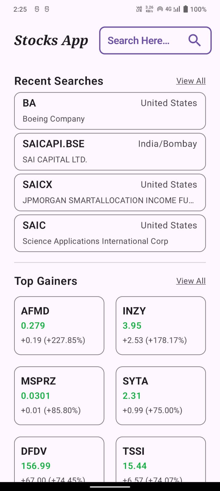
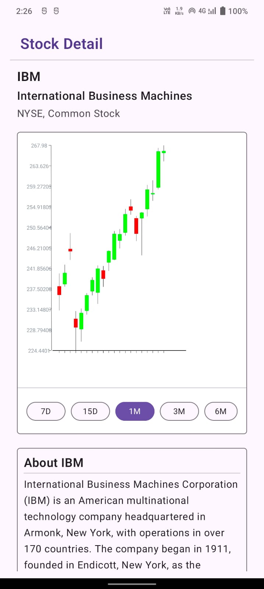

## Stocks App - Explore, Search and View Stock Details

### 🛠️ Tech Stack

- **Language**: Kotlin  
- **UI**: Jetpack Compose  
- **Architecture**: MVVM (Model-View-ViewModel)  
- **Dependency Injection**: Hilt  
- **Database**: Room  
- **Network**: Retrofit + Gson  
- **Charting**: candlestickschartkmm by yashctn88  

---

### 📂 Folder Structure

```text
com.example.stocksapp/
├─ api/
│   ├── responsedto/          # API response data models
│   ├── ApiService.kt         # API call methods
│
├── db/                       # Local Room DB layer
│   ├── dao/                  # DAO interfaces
│   ├── entity/               # Room DB entities
│   ├── MapConverter.kt       # Convert Map<String, Data> <=> String for graph
│   └── StocksDatabase.kt     # Room database setup
│
├── di/                       # Hilt modules
│   ├── NetworkModule.kt      # Retrofit provider
│   ├── DatabaseModule.kt     # Room and DAO provider
│   └── RepositoryModule.kt   # Repository implementation binding
│
├── presentation/             # UI Layer (Jetpack Compose)
│   ├── common/               # Reusable UI components
│   ├── details/              # Stock detail screen with graph
│   ├── explore/              # Explore screen (Top Gainers/Losers, etc.)
│   ├── search/               # Search screen + recent searches
│   ├── viewall/              # View all stocks/searches
│   ├── MainApp.kt            # Contains NavGraph
│   └── Screen.kt             # Sealed class defining screen routes
│
├── repository/               # Repository pattern
│   ├── Repository.kt         # Interface with data functions
│   └── RepositoryImpl.kt     # Implementation of Repository
│
├── utils/                    # Utility helpers, formatters, extensions
│
└── MainActivity.kt           # App entry point and Hilt setup
```

### To Run on your System
Add Api key in local properties as -
API_KEY="key"

### Screenshots
 |  


### Demo Video

